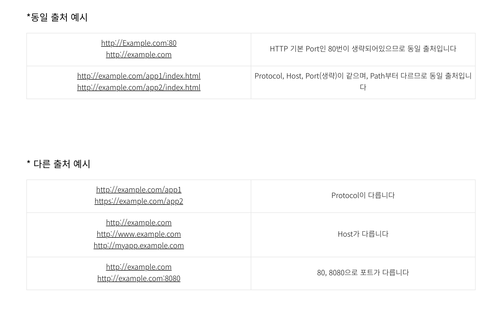
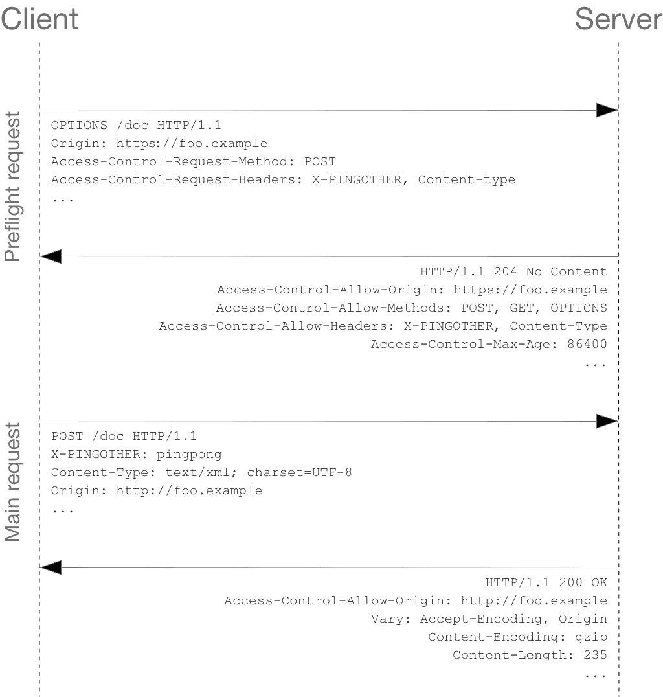
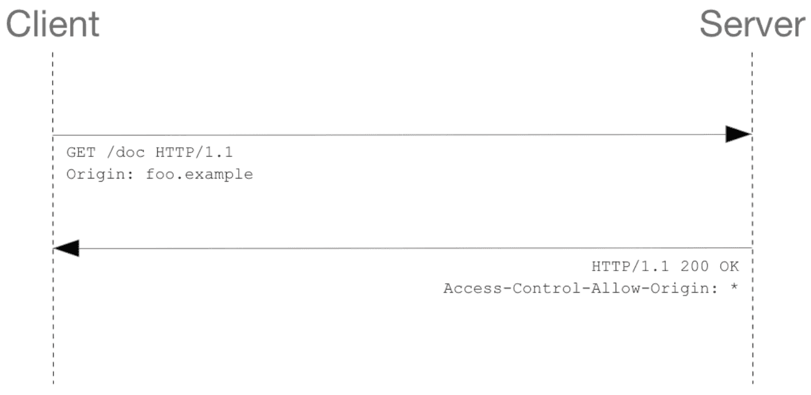

### CORS란

CORS(Cross-Origin Resource Sharing)는 출처가 다른 자원들을 공유한다는 뜻으로, 한 출처에 있는 자원에서 다른 출처에 있는 자원에 접근하도록 하는 개념입니다. 직역하면, 교차되는 출처 자원들의 공유입니다. 다른 출처에 있는 자원을 요청한다고 하면, 이를 교차 출처 요청이라고 부릅니다.

교차 출처 리소스 공유(Cross-Origin Resource Sharing, CORS)는 추가 HTTP 헤더를 사용하여, 한 출처에서 실행 중인 웹 애플리케이션이 다른 출처의 선택한 자원에 접근할 수 있는 권한을 부여하도록 브라우저에 알려주는 체제입니다. 웹 애플리케이션은 리소스가 자신의 출처(도메인, 프로토콜, 포트)와 다를 때 교차 출처 HTTP 요청을 실행합니다.

먼저 출처라는 개념을 알아야 합니다. 다른 블로그에서 이쁘게 정리한 사진을 가져와봤습니다. 평소 접근하는 URL이 어떤 구성요로 이루어져 있는지 아래에 나와 있습니다. 여기서 어디까지를 같은 출처라고 부를까요?

위의 구성요소 중에서 Protocol + Host + Port 3가지가 같으면 동일 출처(Origin)라고 합니다.

### CORS 동작 방식

- 프리플라이트 요청 (Preflight Request)
 
    
    프리플라이트 요청은 두가지로 나눌수 있다.
    예비 요청과 본요청으로 나눈다.
    OPTIONS 메서드를 통해 다른 도메인의 리소스에 요청이 가능한지 (실제 요청이 전송하기에 안전한지) 확인 작업을 하고, 요청이 가능하다면 실제 요청을 보낸다. Cross-origin 요청은 유저 데이터에 영향을 줄 수 있기 때문에 Preflight 요청을 한다.

- 단순 요청 (Simple Request)
    
     Preflight Request와 다르게 요청을 보내면서 즉시 cross origin인지 확인하는데, 다음 조건을 모두 충족해야한다.

    - 메서드는 GET POST HEAD 중 하나
    - 헤더는 Accept, Accept-Language, Content-Language, Content-Type 만 허용
    - Content-Type 헤더는 다음의 값들만 허용
       - application/x-www-form-urlencoded
       - multipart/form-data
       - text/plain
- 인증정보 포함 요청 (Request with Credential)

인증 관련 헤더를 포함할 때 사용하는 요청이다. 브라우저가 제공하는 비동기 리소스 요청 API인 XMLHttpRequest 객체나 fetch API는 별도의 옵션 없이 브라우저의 쿠키 정보나 인증과 관련된 헤더를 기본적으로 요청에 담지 않으므로, credentials 옵션을 변경하지 않고서는 cookie를 주고 받을 수 없다.

옵션은 세가지가 있다.

- omit : 절대로 cookie 들을 전송하거나 받지 않는다.
- same-origin : 동일 출처(same origin)이라면, user credentials (cookies, basic http auth 등..)을 전송한다. (default 값)
- include : cross-origin 호출이라 할지라도 언제나 user credentials (cookies, basic http auth 등..)을 전송한다.
