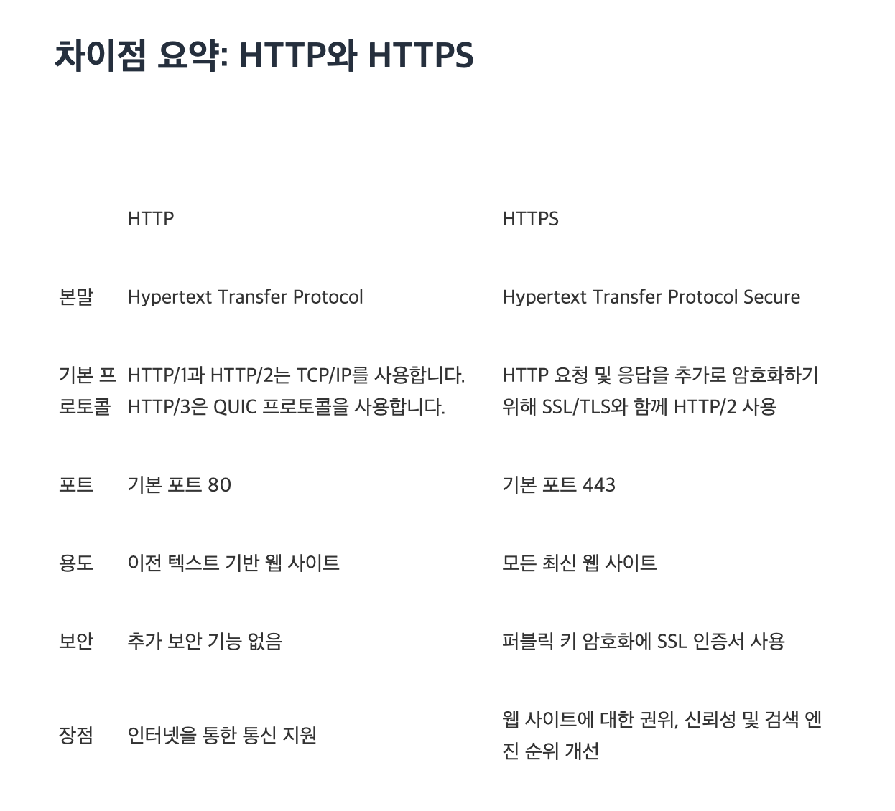

<h1 style="color:purple"> HTTP란?</h1>
<p >HTTP는 (Hypertext Transfer Protocol)는 클라이언트와 서버 간 총신을 위한 통신 규칙 세트 또는 프로토콜이다.사용자가 웹 사이트를 방문하면 사용자 브라우저가 웹 서버에 HTTP 요청을 전송하고 웹 서버는 HTTP 응답으로 응답한다. 웹 서버와 사용자 브라우저는 데이터를 일반 텍스트로 교환합니다. 간단히 말해 HTTP 프로토콜은 네트워크 통신을 작동하게 하는 기본 기술이다.HTTP 서버는 기본 포트인 80번 포트에서 서비스 대기 중이며, 클라이언트(웹 브라우저)가 TCP 80 포트를 사용해 연결하면 서버는 요청에 응답하면서 자료를 전송한다. HTTP는 정보를 텍스트로 주고 받기 때문에 네트워크에서 전송 신호를 인터셉트 하는 경우 원하지 않는 데이터 유출이 발생할 수 있다. 이러한 보안 취약점을 해결하기 위한 프로토콜이 HTTP에 S(Secure Socket)가 추가된 HTTPS이다.</p>

<h2 style="color:purple"> HTTP 프로토콜은 어떻게 작동할까?</h2>
<p>HTTP는 OSI(Open Systems Interconnection) 네트워크 통신 모델의 애플리케이션 계층 프로토콜입니다. HTTP는 여러 유형의 요청과 응답을 정의합니다. 예를 들어, 웹 사이트의 일부 데이터를 보려는 경우 HTTP GET 요청을 전송합니다. 연락처 양식 작성과 같은 일부 정보를 전송하려는 경우 HTTP PUT 요청을 전송합니다.
마찬가지로, 서버는 숫자 코드 및 데이터 양식으로 다양한 유형의 HTTP 응답을 전송합니다. 다음은 몇 가지 예입니다.
</p>

```
100 - 정보 응답
200 - OK(정상)
300 - 리소스가 다른 곳에 있음
400 - Bad request(잘못된 요청) / 클라이언트 에러 응답
404 - Resource not found(리소스를 찾을 수 없음)
500 - Internal server error(내부 서버 오류) / 서버 에러 응답
```

이러한 요청 및 응답 통신은 일반적으로 사용자에게 보이지 않습니다. 브라우저와 웹 서버가 사용하는 통신 방식이므로 World Wide Web은 모든 사용자에게 일관되게 작동한다.

<h1 style="color:purple"> HTTPS란?</h1>
<p>HTTPS는 기본 골격이나 사용 목적 등은 HTTP와 거의 동일하지만, 데이터를 주고 받는 과정에 ‘보안’ 요소가 추가되었다는 것이 가장 큰 차이점이다. HTTPS를 사용하면 서버와 클라이언트 사이의 모든 통신 내용이 암호화된다.HTTPS는 SSL이나 TLS 프로토콜을 통해 세션 데이터를 암호화하며, 기본 TCP/IP 포트는 443이고, SSL 프로토콜 위에서 HTTPS 프로토콜이 동작한다.</p>
<h2 style="color:purple">HTTPS 프로토콜은 어떻게 작동할까?</h2>
<p>HTTP는 암호화되지 않은 데이터를 전송합니다. 즉, 브라우저에서 전송된 정보를 제3자가 가로채고 읽을 수 있습니다. 이는 이상적인 프로세스가 아니었기 때문에, 통신에 또 다른 보안 계층을 추가하기 위해 HTTPS로 확장되었습니다. HTTPS는 HTTP 요청 및 응답을 SSL 및 TLS 기술에 결합합니다.

HTTPS 웹 사이트는 독립된 인증 기관(CA)에서 SSL/TLS 인증서를 획득해야 합니다. 이러한 웹 사이트는 신뢰를 구축하기 위해 데이터를 교환하기 전에 브라우저와 인증서를 공유합니다. SSL 인증서는 암호화 정보도 포함하므로 서버와 웹 브라우저는 암호화된 데이터나 스크램블된 데이터를 교환할 수 있습니다. 프로세스는 다음과 같이 작동합니다.

사용자 브라우저의 주소 표시줄에 https:// URL 형식을 입력하여 HTTPS 웹 사이트를 방문합니다.
브라우저는 서버의 SSL 인증서를 요청하여 사이트의 신뢰성을 검증하려고 시도합니다.
서버는 퍼블릭 키가 포함된 SSL 인증서를 회신으로 전송합니다.
웹 사이트의 SSL 인증서는 서버 아이덴티티를 증명합니다. 브라우저에서 인증되면, 브라우저가 퍼블릭 키를 사용하여 비밀 세션 키가 포함된 메시지를 암호화하고 전송합니다.
웹 서버는 프라이빗 키를 사용하여 메시지를 해독하고 세션 키를 검색합니다. 그런 다음, 세션 키를 암호화하고 브라우저에 승인 메시지를 전송합니다.
이제 브라우저와 웹 서버 모두 동일한 세션 키를 사용하여 메시지를 안전하게 교환하도록 전환합니다.</p>

<h1 style="color:purple">HTTP보다 HTTPS를 선택하는 이유</h1>
<p>다음으로, HTTP와 비교했을 때 HTTPS의 몇 가지 장점에 대해 알아보겠습니다.

보안<br/>
HTTP 메시지는 일반 텍스트이므로, 권한이 없는 당사자가 인터넷을 통해 쉽게 액세스하고 읽을 수 있습니다. 반면, HTTPS는 모든 데이터를 암호화된 형태로 전송합니다. 사용자가 민감한 데이터를 제출할 때 제3자가 네트워크를 통해 해당 데이터를 가로챌 수 없음을 확신할 수 있습니다. 신용카드 세부 정보 또는 고객 개인 정보와 같은 잠재적으로 민감한 정보를 보호하려면 HTTPS를 선택하는 것이 좋습니다.

권위<br/>
검색 엔진은 HTTP의 신뢰성이 더 낮기 때문에 보통 HTTP 웹 사이트 콘텐츠의 순위를 HTTPS 웹 페이지보다 낮게 지정합니다. 고객도 HTTP보다 HTTPS 웹 사이트를 더 선호합니다. 브라우저는 브라우저 주소 표시줄에서 웹 사이트 URL 옆에 있는 자물쇠 아이콘을 배치하여 사용자에게 HTTPS 연결을 표시합니다. 사용자는 이러한 추가 보안 및 신뢰 요소 때문에 HTTPS 웹 사이트 및 애플리케이션을 선호합니다.

성능 및 분석<br/>
HTTPS 웹 애플리케이션은 HTTP 애플리케이션보다 로드 속도가 더 빠릅니다. 마찬가지로, HTTPS는 참조 링크도 더 잘 추적합니다. 추천 트래픽은 광고 또는 소셜 미디어 백링크와 같은 서드 파티 소스에서 생성되는 웹 사이트 트래픽입니다. 분석 소프트웨어가 신뢰할 수 있는 트래픽 소스를 정확하게 식별하도록 하려면 HTTPS를 활성화해야 합니다.</p>

<h1 style="color:purple">요약</h1>

